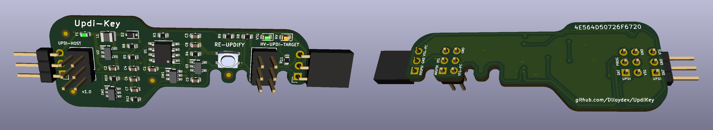

# Updi-Key

Coming soon...

#### What is it?

Updi-Key is an inline adapter that transforms your favorite UPDI programmer into a HV UPDI programmer.  Now you can easily enable UPDI mode, program and power-cycle your target MCU to explore additional features like using the UPDI pin for LUT0, AIN0, GPIO or Reset.

#### Why did you make it?

To provide a tool that allows easy access to the additional functions of the programming pin, which becomes more important in low pin count applications. To enhance your existing programming solution with a convenient low cost adapter.

#### What makes it special?

Unique, versatile, easy to use with the existing programming environment you're already familiar with.

- Converts any UPDI programmer to HV-UPDI
- Connects directly in-line with the MPLAB Snap In-Circuit Debugger (pins 2, 3, 4)
- Connects directly in-line with many ATtiny 0/1/2 development and breakout boards
- Provides standard 6-pin UPDI headers with pin 3 used for additional functions
- The 3-pin UPDI headers can be any combination of male/female or vertical/horizontal at each end
- Automatically provides target power-cycle with current limiting protection
- Directly compatible with any target voltage from 3V to 5V without reprogramming the device
- Host UPDI is inherently protected by using "break-before-make" signal transfer
- No power hungry resistor-diode host UPDI protection circuit required
- Built-in low noise, low EMI, low power 3-5VDC to 12VDC converter (25mA) 
-  Fast HV pulse timing similar to the Atmel Power Debugger
- Continuously monitors host UPDI signal and Re-Updify button on one pin for detecting stable or busy status of the UPDI signal and pushbutton status 
- Green VTG-PC status LED and Orange HV pulse LED
- It seems fitting that the smallest MCU in the family (ATtiny202) operates the key

