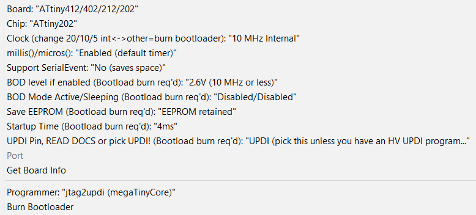

# Updi-Key

#### What is it?

Updi-Key is an inline adapter that transforms your favorite UPDI programmer into a HV UPDI programmer.  Now you can easily enable UPDI mode, program and power-cycle your target MCU to explore additional features like using the UPDI pin for LUT0, AIN0, GPIO or Reset.

#### Why did you make it?

To provide a tool that allows easy access to the additional functions of the programming pin, which becomes more important in low pin count applications. To enhance your existing programming solution with a convenient low cost adapter.

#### What makes it special?

Unique, versatile, easy to use with the existing programming environment you're already familiar with.

- Converts any UPDI programmer to HV-UPDI
- Connects directly in-line with the MPLAB Snap In-Circuit Debugger (pins 2, 3, 4)
- Connects directly in-line with many ATtiny 0/1/2 development and breakout boards
- Provides standard 6-pin UPDI headers with pin 3 used for additional functions
- The 3-pin UPDI headers can be any combination of male/female or vertical/horizontal at each end
- Automatically provides target power-cycle with current limiting protection
- Directly compatible with any target voltage from 3V to 5V without reprogramming the device
- Host UPDI is inherently protected by using "break-before-make" signal transfer
- No power hungry resistor-diode host UPDI protection circuit required
- Built-in low noise, low EMI, low power 3-5VDC to 12VDC converter (25mA) 
-  Fast HV pulse timing similar to the Atmel Power Debugger
- Continuously monitors host UPDI signal and Re-Updify button on one pin for detecting stable or busy status of the UPDI signal and pushbutton status 
- Green VTG-PC status LED and Orange HV pulse LED
- It seems fitting that the smallest MCU in the family (ATtiny202) operates the key

#### Updi-Key Digi-Key BOM

| Item | Qty  | Reference   | Manufacturer  Number                                         | Digi-Key Part Number     | Description                                                |
| ---- | ---- | ----------- | ------------------------------------------------------------ | ------------------------ | ---------------------------------------------------------- |
| 1    | 3    | C1, C7, C8  | [CL10B104KB8NNNC](https://www.mouser.ca/datasheet/2/585/MLCC-1837944.pdf) | 1276-1000-1-ND           | CAP CER 0.1UF 50V X7R 0603                                 |
| 2    | 1    | C6          | [CL10A475KO8NNNC](https://media.digikey.com/pdf/Data%20Sheets/Samsung%20PDFs/CL10A475KO8NNNC_Spec.pdf) | 1276-1784-1-ND           | CAP CER 4.7UF 16V X5R 0603                                 |
| 3    | 1    | D2          | [PMEG4005CEJX](https://assets.nexperia.com/documents/data-sheet/PMEG4005CEJ.pdf) | 1727-8169-1-ND           | DIODE SCHOTTKY 40V 500MA SC90                              |
| 4    | 2    | R8, R9      | [RK73B1JTTD102J](http://www.koaspeer.com/pdfs/RK73B.pdf)     | 2019-K73B1JTTD102JCT-ND  | RES 1K OHM 5% 1/8W 0603                                    |
| 5    | 3    | R3, R4, R10 | [RK73B1JTTD103J](http://www.koaspeer.com/pdfs/RK73B.pdf)     | 2019-RK73B1JTTD103JCT-ND | RES 10K OHM 5% 1/10W 0603                                  |
| 6    | 2    | R11, R12    | [RK73B1JTTD181J](http://www.koaspeer.com/pdfs/RK73B.pdf)     | 2019-RK73B1JTTD181JCT-ND | RES 180 OHM 5% 1/8W 0603                                   |
| 7    | 1    | SW1         | [SN74LVC1G3157DBVR](http://www.ti.com/general/docs/suppproductinfo.tsp?distId=10&gotoUrl=http%3A%2F%2Fwww.ti.com%2Flit%2Fgpn%2Fsn74lvc1g3157) | 296-14908-1-ND           | IC SWITCH SPDT SOT23-6                                     |
| 8    | 1    | R6          | [RC0603FR-0711KL](https://www.yageo.com/upload/media/product/productsearch/datasheet/rchip/PYu-RC_Group_51_RoHS_L_11.pdf) | 311-11.0KHRCT-ND         | RES SMD 11K OHM 1% 1/10W 0603                              |
| 9    | 1    | R5          | [RC0603FR-07102KL](https://www.yageo.com/upload/media/product/productsearch/datasheet/rchip/PYu-RC_Group_51_RoHS_L_11.pdf) | 311-102KHRCT-ND          | RES SMD 102K OHM 1% 1/10W 0603                             |
| 10   | 1    | C4          | [CC0603BRNPO9BNR68](https://www.yageo.com/upload/media/product/productsearch/datasheet/mlcc/UPY-GP_NP0_16V-to-50V_18.pdf) | 311-3842-1-ND            | CAP CER 0.68PF 50V NPO 0603                                |
| 11   | 1    | VTG1        | [LG Q396-PS-35](https://dammedia.osram.info/media/resource/hires/osram-dam-2493948/LG%20Q396.pdf) | 475-3754-1-ND            | LED GREEN DIFFUSED 0603 SMD                                |
| 12   | 1    | F1          | [0ZCM0005FF2G](https://belfuse.com/resources/datasheets/circuitprotection/ds-cp-0zcm-series.pdf) | 507-1816-1-ND            | PTC RESET FUSE 15V 50MA 0603                               |
| 13   | 1    | U3          | [MIC2091-1YM5-TR](http://www.microchip.com/mymicrochip/filehandler.aspx?ddocname=en579481) | 576-3891-1-ND            | MICROCHIP - MIC2091-1YM5-TR - POWER SWITCH, 100MA, SOT23-5 |
| 14   | 1    | L1          | [CBC2518T470K](https://www.mouser.ca/datasheet/2/396/wound02_e-13113-1206718.pdf) | 587-3060-1-ND            | FIXED IND 47UH 290MA 2.47 OHM                              |
| 15   | 3    | C2, C3, C5  | [LMK107BBJ106MALT](https://www.mouser.ca/datasheet/2/396/wound02_e-13113-1206718.pdf) | 587-3258-1-ND            | CAP CER 10UF 10V X5R 0603                                  |
| 16   | 1    | HV1         | [APTD1608SECK/J4-PF](https://www.mouser.ca/datasheet/2/216/APTD1608SECK-J4-PF-472092.pdf) | 754-1802-1-ND            | LED ORANGE CLEAR 0603 (1608 Metric)                        |
| 17   | 1    | U1          | [ATTINY202-SSNR](http://ww1.microchip.com/downloads/en/DeviceDoc/ATtiny202-402-AVR-MCU-with-Core-Independent-Peripherals_and-picoPower-40001969A.pdf) | ATTINY202-SSNRCT-ND      | IC MCU 8BIT 2KB FLASH 8SOIC                                |
| 18   | 1    | SW3         | [PTS810SJG250SMTRLFS](https://dznh3ojzb2azq.cloudfront.net/products/Tactile/PTS810/documents/datasheet.pdf) | CKN10504CT-ND            | SWITCH TACTILE SPST-NO 0.05A 16V                           |
| 19   | 1    | SW2         | [ISL43210IHZ-T](https://www.renesas.com/en-us/www/doc/datasheet/isl43210.pdf) | ISL43210IHZCT-ND         | IC SWITCH SPDT SOT23-6, Marking GJQG                       |
| 20   | 1    | U2          | [NCP1406SNT1G](http://www.onsemi.com/pub/Collateral/NCP1406-D.PDF) | NCP1406SNT1GOSCT-ND      | IC REG BUCK BST ADJ 25MA 5TSOP                             |

#### Schematic

#### Firmware Installation

1. Connect a UPDI programmer to J3 (Pin2  VTG to VCC, Pin3 PROG to UPDI, Pin6 to GND)

2. Install the latest version of [megaTinyCore](https://github.com/SpenceKonde/megaTinyCore/blob/master/Installation.md)

3. Install the [Updi-Key Firmware](https://github.com/Dlloydev/Updi-Key) 

   ●  Click on the green "Clone or download" button, then select "Download ZIP".

   ●  Unzip this file in a folder on your PC.

   ●  In the Arduino IDE, open the sketch "UpdiKey.ino" in the "source\updikey" folder

   ●  Use these board settings:

   

   ●  Select "Burn Bootloader" then "Upload Using Programmer" from the Arduino IDE.  Updi-Key is now ready to use.

#### Functional Description

**High Voltage Programming Options**

| Mode                                | Description                                                  |
| ----------------------------------- | ------------------------------------------------------------ |
| Simple High Voltage Pulse           | On power-up, Updi-Key safely transfers onto the UPDI signal and applies the 12V pulse,  triggers low to initiate the enable sequence then sends the SYNC character and the NVMPROG key, then switches the signal back to the host programmer. The target's PA0 pin remains in UPDI mode as long as power remains on. For additional programming sessions, pressing the Re-updify button is not required. Any changes to the fuses will get loaded on the next power-up. |
| Auto Power Cycle High Voltage Pulse | On power-up, the target's PA0 pin is changed to UPDI mode as described above. After programming, an automatic power-cycle will occur and any new fuse settings will take effect. If re-programming is required, press the Re-updify button first.  This power-cycles and sends the HV pulse and enable sequence to re-activate UPDI mode. |

**UPDI Host Pin Description**

| Pin  | Name      | Type  | Description                   |
| ---- | --------- | ----- | ----------------------------- |
| J2-1 | UPDI-HOST | I/O   | UPDI signal from programmer   |
| J2-2 | GND       | Power | Ground                        |
| J2-3 | VTG       | Power | Target voltage supply (3-5V)  |
|      |           |       |                               |
| J3-1 | UPDI-HOST | I/O   | UPDI signal from programmer   |
| J3-2 | VTG       | Power | Target voltage supply (3-5V)  |
| J3-3 | PROG      | I/O   | Updi-Key UPDI programming pin |
| J3-6 | GND       | Power | Ground                        |

**UPDI Target Pin Description**

| Pin  | Name          | Type  | Description                                                  |
| ---- | ------------- | ----- | ------------------------------------------------------------ |
| J5-1 | HVUPDI-TARGET | I/O   | HVUPDI signal to target                                      |
| J5-2 | GND           | Power | Ground                                                       |
| J5-3 | VTG-PC        | Power | Target voltage supply (3-5V)  with Power Cycle and 100mA current limiting |
|      |               |       |                                                              |
| J4-1 | HVUPDI-TARGET | I/O   | HVUPDI signal to target                                      |
| J4-2 | VTG-PC        | Power | Target voltage supply (3-5V)  with Power Cycle and 100mA current limiting |
| J4-3 | VTG           | I/O   | Target voltage supply (3-5V)                                 |
| J4-6 | GND           | Power | Ground                                                       |

**Green VTG LED:**

This LED is connected to VTG-PC so it will be both power on indication and power-cycle indication.

**Orange HV LED**:

On power-up or just after the Re-Updify button is released, the orange HV LED will be on during the HV pulse and enable sequence.

**Target Power:**

**VTG-PC:**  This pin is the output of the MIC2091 power switch that is optimized for 100mA over-current limiting and circuit protection.

**VTG:**  This pin connects directly to your external power source.

**Re-Updify:**

This button is used just prior to re-programming when using "Auto Power Cycle and High Voltage Pulse" mode.

